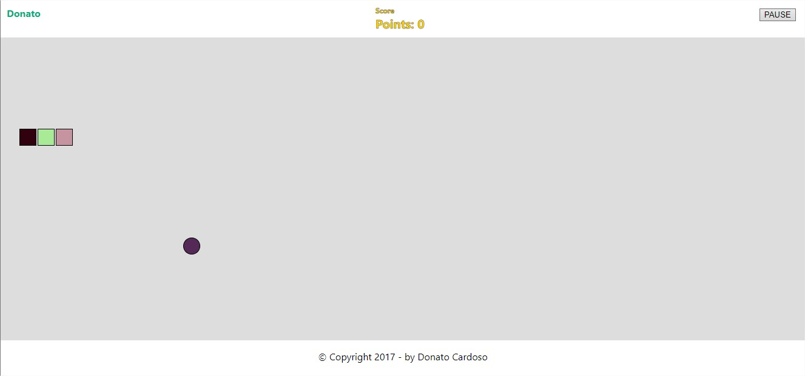
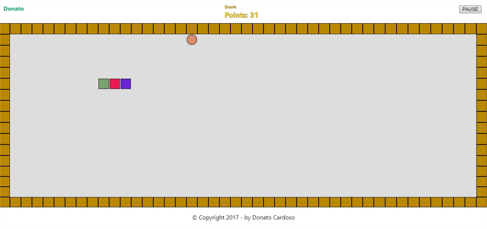
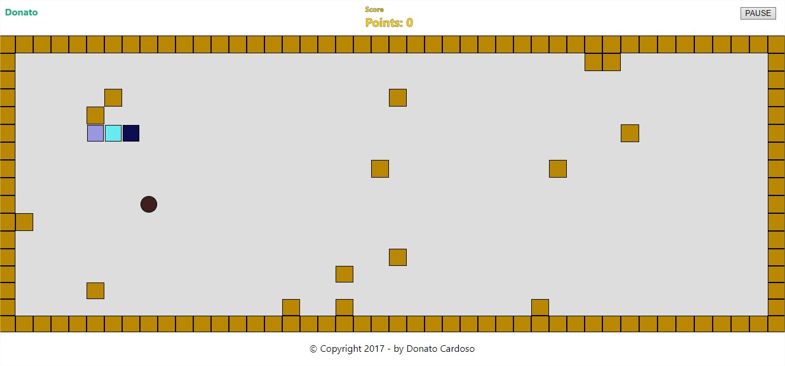

# Snake Game

> This game was developed in JavaScript with the help of JQuery. Initially in all phases the snake has size 3, the total is 3 phases.

> In phase 1, the snake can walk freely and to pass the phase 30 points are needed. 
In phase 2, 4 walls are added and 70 points are required to go from phase. 
In phase 3, obstacles are added in the game and there is no limit of punctuation. 

<table>
    <tbody>
        <tr>
            <td>* Login:</td>
            <td>* Phase One:</td>
        </tr>
        <tr>
            <td><kbd></kbd></td>
            <td><kbd></kbd></td>
        </tr>
        <tr>
            <td>* Phase Two:</td>
            <td>* Phase Three:</td>
        </tr>
        <tr>
            <td><kbd></kbd></td>
            <td><kbd></kbd></td>
        </tr>
    <tbody>
</table>

## Playing Game

> To play use as a WASD trash or as Arrow keys, to play the game or to get more information, use a P key.

## Release History

* 0.0.1
    * Work in progress

## Meta

> Donato Cardoso Ávila - [GitLab](https://gitlab.com/donatocardoso) - [Linkedin](www.linkedin.com/in/donato-cardoso) - Email: donatocardoso11@gmail.com

## Contributing

> 1. Fork it (<https://gitlab.com/donatocardoso/snake-game>)
> 2. Create your feature branch (`git checkout -b nameBranch`)
> 3. Commit your changes (`git commit -am 'nameBranch - Add message'`)
> 4. Push to the branch (`git push origin nameBranch`)
> 5. Create a new Pull Request
